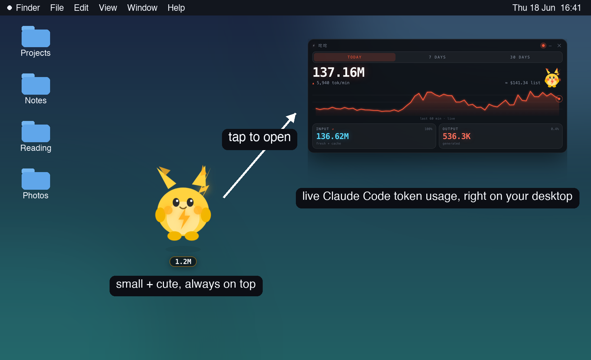
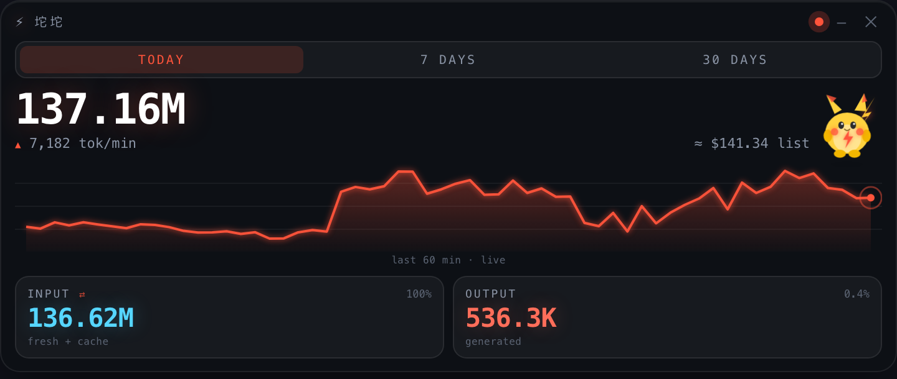

# ⚡ 坨坨 (tuotuo)

A tiny always-on-top **token HUD + electric pet** for [Claude Code](https://claude.com/claude-code).
It shows your live token burn — today / 7d / 30d, input vs output, list-price cost —
recomputed every 2 seconds straight from your local `~/.claude/projects/*.jsonl` logs.
**No API key. No network. 100% local.**

> macOS. The electric-mouse mascot is original, hand-drawn SVG — fork it freely.



## What it does
- **Live token usage** — `TODAY` / `7 DAYS` / `30 DAYS` tabs drive a big total, an input/output split, and cost.
- **Honest counts** — dedupes by `message.id` (Claude Code copies each turn into many files; counting raw inflates totals ~3–4×).
- **List-price cost** — per-model `$` estimate at public API rates; no account or billing access needed.
- **Period-aware chart** — a 60-minute live sparkline for today, daily bars for 7d/30d. The whole UI runs cool (cyan) → hot (red) with your burn rate.
- **An electric pet** — it idles, hops + spins on hover, and fires a thunderbolt on click. Drag it anywhere (position persists), or collapse it to a floating mini-pet with a token badge.



## Run it
Requires **Node 18+** on **macOS**.

```bash
git clone https://github.com/Yeff144725/tuotuo.git
cd tuotuo
npm install
npm start
```

Quit from the **⚡ menu-bar icon**. (Or double-click `start.command` in Finder — it installs deps on first run.) Run `npm run report` for a plain-text dump.

## Make it permanent (optional)
Turn it into a real, Spotlight-searchable app that **auto-starts at login and relaunches itself if it's ever killed**:

```bash
./install.sh              # installs ~/Applications/坨坨.app + a LaunchAgent
./install.sh --uninstall  # removes both
```

Heads-up: that's a login-persistence mechanism (a macOS `LaunchAgent`). It only ever launches this app, and a deliberate **Quit** stays quit — but now you know exactly what it does.

## What the numbers mean
| Field | Meaning |
|---|---|
| **Total** | every token processed in the selected period (input + output + cache reads/writes) |
| **INPUT** | prompt-side tokens = fresh input + cache writes + cache reads (cache reads are usually the bulk); click to toggle fresh-only |
| **OUTPUT** | tokens the model generated |
| **Cost** | list-price *equivalent* at public API rates — what the tokens would cost metered, **not** your bill if you're on a subscription |

**burn** = (input + output) over the last 5 minutes.

## How it works
- `aggregator.js` tails the JSONL transcripts in `~/.claude/projects`, dedupes by message id, buckets usage per minute, and exposes a `snapshot()` (today / 7d / 30d, plus a 60-min sparkline, 30-day daily series, burn-per-minute, and per-model mix). Edit `PRICES` there if your rates differ.
- `main.js` is a frameless, transparent, always-on-top Electron shell with a tray icon.
- `renderer/` is the dense panel + the pet (SVG + CSS keyframes).

## License
MIT © Jeff Yang. The mascot is original artwork — fork it freely.
